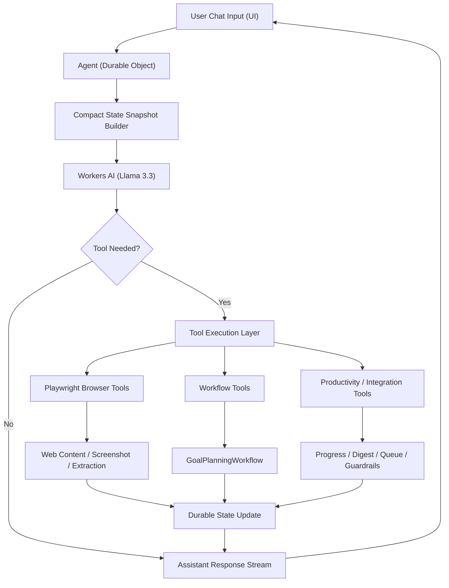

# cf_ai_goal_coach

**Nebula Pilot** is an AI execution copilot built on Cloudflare for an AI application project.

It combines:

- chat-based user input
- Workers AI (Llama 3.3)
- durable memory/state
- workflow coordination
- browser automation via Playwright
- tool-driven execution with guardrails

## Assignment Fit

This project satisfies the required components:

- `LLM`: Workers AI (`@cf/meta/llama-3.3-70b-instruct-fp8-fast`)
- `Workflow / coordination`: Cloudflare Workflows + Agents tools
- `User input`: Chat UI (React + Cloudflare Agents)
- `Memory or state`: Durable Object state persisted by the agent

## Core Capabilities

- Durable user memory: name, goals, cadence, constraints
- Workflow-backed action planning: 7-day plan generation in background
- Browser research tools:
  - `browseAndSummarize`
  - `browseWithScreenshot`
- Structured extraction:
  - `extractStructuredData(url, schema)`
- Verification:
  - `factCheckClaim(claim)`
- Content monitoring:
  - `rssMonitor(feedUrl)`
  - `pdfReader(url)`
- Execution handoff:
  - `calendarSync(...)` for Google/Outlook (webhook or queue fallback)
  - `createWorkItem(...)` for Notion/Jira (webhook or queue fallback)
- Personal productivity layer:
  - `voiceMode(...)`
  - `goalProgressTracker(...)`
  - `emailDigest(...)`
  - `costGuard(...)`

## Context Management Strategy

Nebula Pilot is designed to avoid context-window bloat:

- Large tool outputs are stored in durable state, not repeatedly replayed.
- Each model turn includes a compact state snapshot (profile, plan status, usage, recent progress/events).
- Message history is pruned before model calls.
- `costGuard` limits expensive tool calls and helps prevent runaway usage.

## System Flow



## Tool Flow (Request Lifecycle)

1. User sends prompt in chat UI.
2. Agent loads durable state and compacts it for prompt context.
3. Model decides whether to call a tool.
4. Tool executes and writes essential results to state.
5. Agent returns concise response and optional tool output cards (including screenshots).

## UI Highlights

- Chat-first interface with streaming responses
- `+` tool menu with quick prompts for major tool paths
- Tool output cards in chat
- Screenshot preview rendering for browser screenshot tool
- Memory + workflow status panels

## Tech Stack

- Cloudflare Agents SDK
- Cloudflare Durable Objects
- Cloudflare Workflows
- Workers AI
- Browser Rendering + `@cloudflare/playwright`
- React + Vite + TypeScript
- Wrangler

## Project Structure

```text
src/
  app.tsx      UI, tool prompt menu, message rendering
  client.tsx   React entry
  server.ts    Agent logic, workflows, tool implementations
```

## Local Development

```bash
npm install
npm run types
npm run dev
```

Open `http://localhost:5173`.

## Deploy

```bash
npm run deploy
```

## Example Prompts

- `Create a seven-day action plan for interview prep.`
- `Browse https://blog.cloudflare.com and summarize latest AI updates.`
- `Browse https://blog.cloudflare.com and include a screenshot preview.`
- `Extract data from https://example.com with schema {title:string, points:string[]}.`
- `Fact-check this claim: Workers AI supports Llama 3.3.`
- `Monitor https://blog.cloudflare.com/rss/ and show new items.`
- `Log today as completed and show my streak.`
- `Show cost guard status and set max browser runs to 80.`

## Integration Webhooks (Optional)

The following env vars can enable direct external sync:

- `CALENDAR_SYNC_WEBHOOK`
- `WORK_ITEM_SYNC_WEBHOOK`
- `EMAIL_DIGEST_WEBHOOK`

If not configured, actions are queued in durable state as fallback.

## Notes

- No external LLM key is required for Workers AI usage.
- AI-assisted build prompts are documented in `PROMPTS.md`.
- Repository name keeps Cloudflare assignment prefix: `cf_ai_...`.
